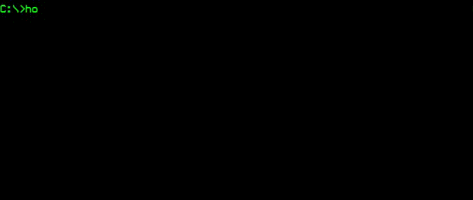

## Part 1: Digging into the Command Line Interface

### Introduction to Developing with Virtual Machines (VMs) and Docker

Learning development on the JavaScript stack can sometimes be quite frustrating (even with tools like Node or NVM). But this is especially true when you manage different applications with different environment dependencies (or different versions of node, npm etc..) for each app that you're developing. Maybe you have some legacy apps that you don't feel like touching, but you want your host machine to have the latest and greatest when you start you next project. That's understandable and we've all been there before.

I used to reach for VMs for all my work. I have a former love affair with Vagrant. Back when I was working on the LAMP stack, it made managing my various projects dependencies and environments a breeze. The VMs helped to ensure consistent behaviour between my home and work machines. But it is quite a bit of overhead to run and have images for all these VMs stored on my development machine, simply to virtualize the environment I want to run my app on.

This is when I started learning more about Docker. Docker differentiates itself by not virtualizing the entire stack from OS up, but rather executed by the Docker engine. These containers are much smaller than VMs and thus have faster startup times and better performance. VMs can take several minutes to create and launch whereas Docker containers can be created and launched in just a few seconds. One thing to remember is that all docker containers on a host will share that host's kernel/OS/hardware. That being said, an application in a Docker container can run anywhere up to twice as fast as in a virtual machine and more containers can share a host because of the shared OS not being duplicated across each VM.

## About Docker


### What is Docker

Docker is a tool we can use to isolate and containerize our application and the environment in which it runs from that of our host machine. This allows us to also version our entire "stack" and all the requirements and dependencies for the application to run within version control.

### Why is Docker so great

This is great for a plethora of reasons, but for me, the main advantage is how easily Docker can be run locally and deployed in production and help ensure that what works on my machine will work on every machine.

> Note: I have run into instances where some of the terminal commands run to execute/build docker commands/images produce some errors when running on Windows, but with minor testing and tweaking, cross platform compatibility can be achieved.

### What does Docker solve

This eliminates the "well, it works on my machine" excuse from your vocabulary. This also helps ensure that any new developer who is on-boarded to your project, once they have git and docker installed, they'll be ready to run your application.

> For our demo, we will be aliasing npm commands to docker commands to make the development cycle more familiar to developers, and so, NPM is a dependency on the host machine, simply to kick start the docker commands.
> These could also be aliased to bash commands but it would make the integration with CI tools, as we will see later, slightly different. Hence, I chose NPM.

## Getting Started with the Command Line



_Fear not the Terminal_

To get started with this demo, you should have Docker installed on your host machine.

> This was written and performed on Mac. If you notice any commands that do not work for Windows, please leave a comment to help out other readers. I'll try to update my notes here too.

### Installing Docker

A quick Google search for "install docker" eventually takes you here: https://docs.docker.com/install/
The installation steps have changed (in terms of where to find the download) a few times. I believe you will need to register for an account with Docker (and/or Docker Hub) but don't worry, we'll be using these later to publish our images to a Docker repository.

Once you've completed the installation, join us back here and we'll review a handful of commands we'll be using over and over to make our lives easier.

> _Note: Terminology_
> We'll be using terms like `build`, `image` and `container` a lot in this article, so I wanted to define them upfront.
> the `build` is the process of taking the steps outlined in the `Dockerfile` (more on that later) to create your `image`.
> the `image` is like an onion, built up in layers from your `Dockerfile`. This is your primary asset. Kind of like a class definition.
> the `container` is an instance of your `image`. A `container` is to an `image`, like an `object` is to a `class`. You can have many containers of the same image if required.

### Simple Commands

So now docker is running. You can confirm this by running `docker -v` in your terminal. At the time of this article, I am using `Docker version 18.09.0, build 4d60db4`. You don't need this version, but later in this series, I am planning to use some of the newer features. I'll try to comment on those sections where a specific version (or newer) would be required.

Running `docker` in your terminal will give you a long list of commands you can use to manage your Docker assets. Let's look at a few:

### `docker ps`

```bash
# Returns a list of running containers
$ docker ps
CONTAINER ID        IMAGE               COMMAND             CREATED             STATUS              PORTS               NAMES
```

Ok, so we see ... nothing. But that's because we have no containers running.. Let's build our first image. For this we will pull a predefined image from docker's repository. It's time for `hello-world`!

### `docker pull`

```bash
$ docker pull hello-world
Using default tag: latest
latest: Pulling from library/hello-world
d1725b59e92d: Pull complete
```

This command allows you to pull prebuilt images from repositories like Docker Hub. Let's see all the repositories we have loaded on our machine.

### `docker images`

```bash
$ docker images
REPOSITORY                          TAG                 IMAGE ID            CREATED             SIZE
hello-world                         latest              4ab4c602aa5e        3 months ago        1.84kB
```

This shows us a list of built images that we have on our machines. You can easily bring up any of these in a container using the command we will look at next: `docker run [IMAGE]:[TAG|'latest']`

### `docker run`

```bash
# This will pull, and run a container with the image provided
$ docker run hello-world

Hello from Docker!
This message shows that your installation appears to be working correctly.
...
```

So what happened here? Basically, first docker looks at your local list of images. Since it didn't find one tagged as `hello-world` it fell-back to _docker hub_ and downloaded the image from that repo. Once it was pulled, Docker then created a container running this image.

But if you read the output from our hello world, they already recommend what to try next.

> To try something more ambitious, you can run an Ubuntu container with:  
> `$ docker run -it ubuntu bash`

Let's see what happens.

```bash
$ docker run -it ubuntu bash
Unable to find image 'ubuntu:latest' locally
latest: Pulling from library/ubuntu
32802c0cfa4d: Pull complete
da1315cffa03: Pull complete
fa83472a3562: Pull complete
f85999a86bef: Pull complete
Digest: sha256:6d0e0c26489e33f5a6f0020edface2727db9489744ecc9b4f50c7fa671f23c49
Status: Downloaded newer image for ubuntu:latest
root@3fab2218a261:/#
```

Now we're inside our Docker container! Crazy right? Try out some simple commands, muck around. Doesn't matter.. We'll review how to kill the container shortly. Right now, nothing inside your container is linked to your file system so anything you do in here will not be persisted.

Go play! I'll wait...

Ok. So, before you `$ exit` your container, let's open a new tab to see a little more of what's going on. In your new container, let's try our `docker ps` command again. You should see an entry like this:

```bash
$ docker ps
CONTAINER ID   IMAGE    COMMAND   CREATED              STATUS              PORTS       NAMES
3fab2218a261   ubuntu   "bash"    About a minute ago   Up About a minute               elated_tesla
```

We have 2 unique identifiers here that we should take note of, the `CONTAINER ID` and the `NAME`. This will allow us to get back into our container from another terminal window. We can try it by doing the next command we'll review.

### `docker exec`

With this docker command, we can execute a command against our running container, and we can even tell docker that we want to remain interactive `-i` and we want to open a terminal `-t` in our command. So, take the `CONTAINER ID` or the `NAME` from your `docker ps` command, and let's get back into our running container with `docker exec` with out `-it` flag.

```bash
$ docker exec -it elated_tesla bash
root@3fab2218a261:/#
```

And we're right back in the terminal of our container! Pretty cool, eh? Ok, let's start cleaning up. Let's simply exit out of the container in our second terminal window with just `$ exit`

Now, let's see the command we would use to stop our container if we weren't logged into the terminal. This is how you will be stopping containers that are running in detached `-d` mode.

### `docker stop`

```bash
$ docker stop elated_tesla
elated_tesla
```

Now, if we run `docker ps` again, we'll see an empty list. Well, that is a little misleading. Since Docker isn't _persisting_ to our host machine, it didn't just kill off everything we've done. The container still exists, but we can't see it. Let's add a flag to our `docker ps` command.

```bash
$ docker ps -a
CONTAINER ID        IMAGE                          COMMAND                  CREATED             STATUS                        PORTS                  NAMES
3fab2218a261        ubuntu                         "bash"                   10 minutes ago      Exited (0) 43 seconds ago                            elated_tesla
6088b6cbbab0        hello-world                    "/hello"                 13 minutes ago      Exited (0) 13 minutes ago                            upbeat_robinson
```

Found em! The problem is, they're still consuming some (not much, but some) resources. Let's full clear them out. Keep in mind that anything you did inside of the container really will be lost once we fully remove the container. But in this case, that is fully ok. We want a fresh start.

### `docker rm`

```bash
$ docker rm elated_tesla
elated_tesla
```

Now, when we run `docker ps -a` again, we'll see this has been removed from our list of stopped containers. However, if we run `docker images` we will see that `ubuntu` is still an image we have on our host machine. This just means when we spin up a new container, we won't need to download anything from Docker Hub (unless we use a different tag than the one we have locally)

> Although we won't got into it in this article, if system resources ever become an issue, you can run `docker image prune` or `docker container prune` to free up some resources.

## Recap

Ok! So, we covered off how to pull images, turn them into containers, start and stop, remove and execute against them. We're at a pretty good place, we can start to look at building our own custom Docker images! Stay tuned for part 2 where we'll dockerize a simple Vuejs app!

Please, feel free to do your happy dance in the meantime ;)


