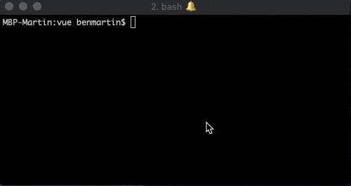
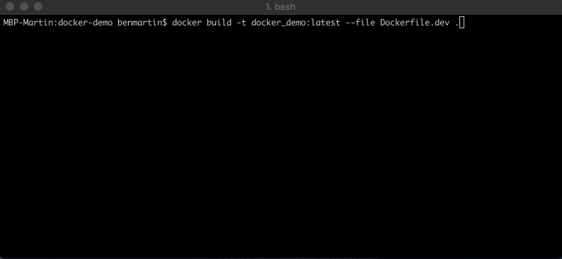
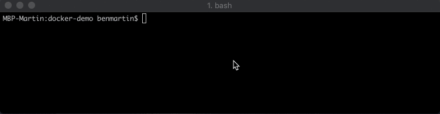
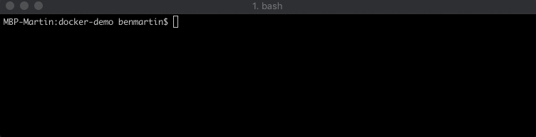
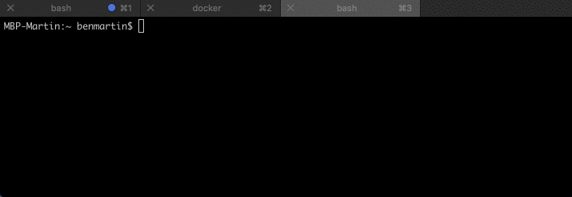

Let’s take a moment to consider what is important for local development. For me, I want to make sure all my developers are using the same dependencies, and I don't want to worry about what versions they have installed. No more “but it works on my machine” excuses. At the same time, I want to make sure we retain the conveniences of HMR (Hot Module Replacement) so that developers don't need to constantly refresh the application to see their changes reflected. We don’t want to lose fast feedback.

In this article, we'll look at how we can setup Docker for a boilerplate VueJS app with custom `Dockerfile`s from which our images and containers will be built and how we gain efficiencies from these.

In case you missed the first part in this series, [check here to learn more about the command line interface](https://benjaminmartin.dev/02-docker-learning-the-command-line/) that Docker ships with. We need to use the commands from that article in this section. If you are already familiar with Docker CLI, please continue to follow along.

## Prerequisite: Create our project

This is of course a Docker article, so please ensure you have Docker installed. You can follow [the official install instructions for Docker here](https://docs.docker.com/install/). Since I'm using Vue, I've used the VueCLI to spin up a quick workspace with `vue create docker-demo`.

> The configuration I selected (seen below) will be relevant to do E2E testing and unit testing which will become part of our CI/CD pipeline.



Once everything is installed, `cd` into our new project folder, open an IDE and let's dig in.

## Custom Docker Image for Development

If you've played with Docker but not built your own image, you probably know we specify an image when we execute our `docker run` command. Those images are pulled from Docker Hub or some other remote repository (if that image is not found locally). In our case though, we want to build a custom image.

In the root of our project, create a file named `Dockerfile.dev`. This will be our development image. In that file, copy the following code into it.

```dockerfile
# Base Image
FROM node:9.11.1

ENV NODE_ENV=development
ENV PORT=8080

WORKDIR /usr/src/app
COPY package*.json /usr/src/app/
RUN cd /usr/src/app && CI=true npm install

EXPOSE 8080
CMD ["npm", "run", "serve"]
```

Ok... but what does all this do? Let's dig into it.

### Dockerfile Commands and Keywords

**`FROM`** specifies the preexisting image on which to build our custom image. Since we are running a node application, we've chosen one of their official Docker images.

> FROM node:9.11.1 means our application image will start with the node v 9.11.1 image

**`ENV`** sets environment variables

> **`ENV PORT=8080`** sets the environment variable `PORT` for later use
>
> **`ENV NODE_ENV=development`** sets the environment variable `NODE_ENV` for use within our app

**`WORKDIR`** sets the working directory within the container

> **`WORKDIR /usr/src/app`** defines `/usr/src/app/` as our working directory within the docker image

**`COPY`** copies new files, directories or remote files into the container/image

> **`COPY package*.json /usr/src/app/`** copies our `package.json` and `package-lock.json` into our working directory

**`RUN`** executes a command in a new layer on top of the current image and commits it. When you run the build, you will see a hash representing each layer of our final image

> **`RUN cd /usr/src/app/ && CI=true npm install`** changes the working directory to where the `package.json` is and installs all our dependencies to this folder within the image. This makes it so that the image holds frozen copies of the dependencies. Our Docker image, not our host machine, is responsible for our dependencies

**`EXPOSE`** allows us to access a port on the container from our host machine

> **`EXPOSE 8080`** matches the port on which our app is running, inside the container and allows us to access our app from our host machine

**`CMD`** provides the default initialization command to run when our container is created, like a startup script

> **`CMD ["npm", "run", "serve"]`** sets this as our default command when we start our container. This is not run when building the image, it only defines what command should be run when the container starts.

I know you're anxious to get this running, but hold your horses. Let's look _closer_ at our `Dockerfile.dev` and understand _why_ we did what we did.

### Dockerfile Structure Recommendations

So, _Where's my app?_

Right. We didn't use the `COPY` command to copy our full workspace. Had we done so, we'd need to run `docker build` and `docker run` for every code change. We don't want to do this over and over for development. We can be more efficient

#### Caching Dependencies

We are taking advantage of how Docker layers the images. As Docker builds our image, you'll see a hash for each layer as it is completed. What’s more is that Docker also caches these layers. If Docker can see that nothing has changed on that layer from a previous build (and previous layers are also identical) then Docker will use a cached version of that layer, saving you and your developers precious time! When a layer changes, any cached layers on top of it are invalidated and will be rebuilt.

_Therefore, if there is no change to our `package.json` or the `package-lock.json` then our entire image is cacheable and doesn't need to be rebuilt!_

#### Priority

This is also why you want to have other `Dockerfile` commands that change less frequently near the top of our file. As soon as one layer of our cache is invalidated, for example, if you change `ENV PORT=8080` to another port, that cached layer and every cached layer after it is invalidated and Docker will have to rebuild those layers.

### Building the Custom Docker Image

Now, build the image with this command: `docker build --tag docker_demo:latest --file Dockerfile.dev .`



> Using **`--tag`** in the `docker build` command allows us to easily reference this image from our `docker run` command
>
> The `.` at the end of the `docker build` command references the context where our custom `Dockerfile` can be found. So, this command should be run from the root of our project directory

You can run it with `docker run docker_demo:latest`, but unfortunately, we have more work to do to get it working quickly and easily from the command line.

### Running our Container: Quality of Life Improvements

We’re going to be executing our `docker run` command daily, if not more frequently. However, if we simply execute the `docker run docker_demo:latest` command, Docker will create a _new_ container each time. Docker won’t stop the old container unless you do so explicitly. This is very useful in many cases, but since we've hardcoded the host port, we'll run into port collisions on our host machine.

In order for us to easily stop and remove our old containers, we should name them so we can easily refer to them later. Additionally, I want the running container to be removed if I cancel the running process.

```
docker run --rm -it \
--name docker_demo_container \
docker_demo:latest
```



#### What was added?

We added a `--name` field to the end of our run command. This allows us to reference the container without looking up the hash. Now, we can easily stop our container by name.

We also added the `--rm` and `-it` flags to our `docker run` command. The `--rm` flag tells Docker to remove the container if and when it is stopped. The `-it` flag keeps the terminal live and interactive once the container is started.

#### Mounting Host Directories

Let's go back to our `docker run` command and let's find a way to mount our workspace directory to a folder within our container. We can do this by adding a mount point to our container in the `docker run` command. This will tell Docker that we want to create an active link between our host machine’s folder (`src`) and the Docker container folder (`dst`). Our new command should look like this:

```
docker run --rm -it \
--name docker_demo_container \
--mount type=bind,src=`pwd`,dst=/usr/src/app \
docker_demo:latest
```

But this could conflict with our host machine's `node_modules` folder since we're mounting our entire `pwd` to our app's location in the image (in case one of our developers accidentally runs `npm install` on their host machine). So, let's add a volume to ensure we preserve the `node_modules` that exists within our container.

```
docker run --rm -it \
--name docker_demo_container \
--mount type=bind,src=`pwd`,dst=/usr/src/app \
--volume /usr/src/app/node_modules \
docker_demo:latest
```

#### Accessing Ports Inside the Container

If you tried the above command (and you're running a VueJS app), you should see:

```
 App running at:
  - Local:   http://localhost:8080/

  It seems you are running Vue CLI inside a container.
  Access the dev server via http://localhost:<your container's external mapped port>/
```

Docker is giving you a hint that we need to **expose** a port from our container and **publish** it on our host machine. We do this by adding the `--publish` flag to our run command. (We already have the `EXPOSE` command in our `Dockerfile.dev`)

> **`--publish <host-port>:<container-port>`** tells Docker that traffic to the host machine (i.e. via localhost) on port `<host-port>` should be directed towards the container at the `<container-port>` that you define.

### `docker run` in One Command

Let's take a look at our final run command:

```
docker run --rm -it \
--name docker_demo_container \
--publish 4200:8080 \
--mount type=bind,src=`pwd`,dst=/usr/src/app \
--volume /usr/src/app/node_modules \
docker_demo:latest
```



Running the above command will finally allow us to access our app via http://localhost:4200.

### Testing it out

Let's build a fresh copy and run it. If you try changing one of our file's templates, you'll see everything is still functioning as it should be.

But speaking of testing, what about unit tests? Well, once our container is running, we can open a new terminal and `docker exec` a command to run in our container.

```
docker exec -it docker_demo_container npm run test:unit
```



The above command will create an interactive terminal connection with our container `docker_demo_container` and execute the command `npm run test:unit` in it, allowing us to run unit tests for our app.

## In Closing

We now have a way to build our development images and run them locally while maintaining the conveniences of Hot Module Replacement to keep our development workflow efficient. Our developers don't need to worry about dependencies on their host machine colliding with those in the image. No more "but it works on my machine" excuses. And, we also have a command we can easily run to execute our unit tests.

If you find anything I missed or want to chat more about Docker, please reach out to me!
