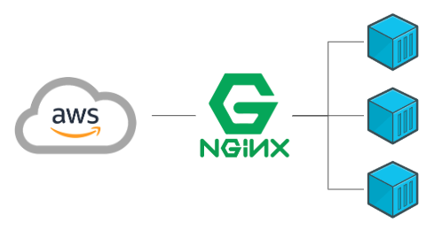

If you've been following along with my Docker series (you can find [my latest article about Continuous Integration (CI) here](https://benjaminmartin.dev/04-docker-continuous-integration-and-e2e-with-cypress/)) then you must be pretty happy to have your CI pipeline solving **all** the world's problems. Your developers are pretty content, but we know there's more we could do. And, I mean, isn't developer happiness the _real_ reason you're reading a DevOps article?

In this article, I'll outline how you can take the CI pipeline one step further to address the Continuous Deployment (CD) aspect of CICD. More specifically, we'll address how one would configure **feature branch specific** deployments of our app in order to quickly and easily manually test their features, even on mobile devices, before merging their feature branch PR to the develop branch.

## Prerequisite Knowledge

If you haven't been following along with [my previous articles](https://benjaminmartin.dev), to get the most out of this article, you should first have a Dockerized application. If you also have a CircleCI pipeline configured, that's a huge head start! We will be building off that. In our hypothetical situation, we're using an AWS EC2 instance from the free tier in AWS. If you're new to AWS, this could easily be replaced by other technologies. One would only need a server to deploy to. In the past, I used a \$5 Digital Ocean droplet to accomplish the same effect, but it's up to you to determine where you want to deploy.

Here's what you'll need:

- An AWS Account with an EC2 instance configured to expose ports 22, 80 and 443 and an SSH key for CircleCI to use
- Source code of Dockerized App hosted on GitHub
- Docker Hub (or some other Docker image repository you can publish to)
- CircleCI connected to your app's GitHub repo and your Docker Hub repo
- Domain name pointing to your server
- Wildcard TLS Certificate for the above domain name

> Note: Details for most of the above, aside from anything deployment related, can be found in [my previous article.](https://benjaminmartin.dev/04-docker-continuous-integration-and-e2e-with-cypress)

## The Goal: Fast Feedback

As a huge proponent of Agile development methodologies, fast feedback is critical for success, and the higher fidelity the feedback, the better! Unit tests and end-to-end tests all have their place. But, having human eyes review UI changes running in a production-like environment in the browser helps us identify bugs before they become an issue that could impact other teams.

### Why should I bother?

In my case, I was working on a project recently where I was developing an Angular application to be consumed through a mobile device. The app required use of the mobile device's camera and accelerometer for the features I was developing. Thus, I wanted to be able to quickly test these features with my actual phone while I was still working out the implementation details.

Sounds simple enough, I just needed to deploy my code somewhere I could access from my device. But this process needed to be automated.

I decided to leverage my existing CI pipeline and extend it to do Continuous Deployments (CD). My CI pipeline was already configured to run my unit tests and end-to-end tests, but I wanted to also deploy my code to a server that I could access from my phone for manual testing.

Here are some key considerations for extending this CI/CD pipeline.

## Feature Branch Environments

If you've worked on an enterprise webapp, you may be familiar with terms like `dev`, `int(egration)` and `staging`. Typically, these are environments where different states of our application reside. Each of these environments are meant to host various states of your app, whether that be the branch actively under development, your next release or the last release that you're still supporting with bug fixes.

What often gets lost in the mix is our `feature` branches. When our developers pick up a ticket, they may want to actively test their code on a suite of devices to ensure cross device and cross browser compatibility. Plus, having this requirement for our developers acts as an additional safeguard for preventing bugs from getting into the `develop` branch of our code.

If you have ever asked your boss for _branch specific environments_, you may well have been scoffed at claiming _"there's no room in the budget"_. Well, what if I told you that through the power of Docker and the free tier on AWS (or an existing server you may have running), you can have branch-specific environments beyond `dev`, `int` and `staging`.

## Docker To The Rescue!

Docker is the perfect tool for solving this issue for several reasons. In order to see why, consider what would be difficult about running multiple copies of our app on the same environment. Well, even if we imagine a static site there's a lot to cover off. When we deploy our app, what folder do we deploy it to? How do we handle port collisions? Asset loading with relative URLs? How do we notify nginx of the new route/site? There's a lot of configuration and mess that goes into doing it directly on the host machine that we can delegate to Docker to handle for us.



In the end, we'll have a long lived reverse nginx proxy running in a container on our host machine. This container will listen to Docker for other containers we run. Using environment variables in the `docker run` command, we will be able to tell this nginx proxy to update the configuration to point dynamic subdomains to our feature branch specific containers.

### Docker with nginx

Most of the heavy lifting is done by the nginx proxy container. I found [an excellent dockerized nginx proxy on GitHub](https://github.com/jwilder/nginx-proxy) to aid in this process. What is useful about this Docker image is that once you have it running, it will listen to your other `docker` commands that are run on the host machine, in particular your `docker run` command. In particular, it will look for environment variables attached to your `docker run` command to interpret how to update the internal configuration and point it to your app container that is being started.

This reverse proxy image should be running in a container on your server. This container's role is to listen to other Docker commands that you run and automatically update the nginx configuration within this reverse proxy container.

## Passing Inputs to your Docker Run

Once you have the nginx proxy running in a Docker container, you can leverage your CI pipeline (like CircleCI) to get the environment variables needed to pass to your server in the `docker run` command. Just make sure that CircleCI is authorized to access your server via SSH. A secure way to do this is using SSH keys. Generate a key and [provide the private key to CircleCI](https://circleci.com/docs/2.0/add-ssh-key/).

Then, add the public key to the `~/.ssh/authorized_keys` of your server. From there, make a bash script to manage your branch-specific containers.

[CircleCI exposes a number of environment variables](https://circleci.com/docs/2.0/env-vars/) to your pipeline that you can use in your jobs to pass to your bash script.

In my case, I used CircleCI to run `scp` to copy a deployment script to the testing server. Once the bash file is there, it would be executed with the arguments to tell it what sub-domain to use for this container. I used a sanitized version of the branch name. For example, `feature/ABC-42-my-feature` becomes `feature_abc-42-my-feature.myexampledomain.com` That subdomain would also be the alias for the container, allowing my script to stop a running container with outdated code when new commits are made to that particular branch.

Here's an example of the run command from my deployment script that provides the environment variables (`VIRTUAL_HOST`, `VIRTUAL_PROTO` and `VIRTUAL_PORT`) expected by the reverse nginx proxy container. The nginx container is listening to the Docker process on your host machine. When it sees a `docker run` command, it is also looking for those three environment variables. If it sees them in the command, it will update the nginx configuration to point the virtual host to the container that is being run. This is the command that will be run on the host machine to deploy. These environment variables are defined in the CI pipeline.

```
docker run --expose 443 -e VIRTUAL_HOST=${URL_SUBDOMAIN}.myexampledomain.com -e VIRTUAL_PROTO=https -e VIRTUAL_PORT=443 -d --rm=true --name ${CONTAINER_NAME} ${DOCKER_IMAGE}
```

The environment variables I am using here are set inside my bash script to ensure I pull the correct image, apply the right name to the container and assign the URL, port and protocol. Putting it together, we can add a "job" to our CircleCI configuration aliased as `deploy`. This deploy job would look something like this.

```
scp deploy-${IMAGE_NAME}.sh ${PROD_SERVER_USER}@${PROD_SERVER_HOST}:/root/
ssh -o StrictHostKeyChecking=no ${PROD_SERVER_USER}@${PROD_SERVER_HOST} "/bin/bash /root/deploy-${IMAGE_NAME}.sh $IMAGE_NAME:$TAG ${URL_SUBDOMAIN}"
```

> Note: `PROD_SERVER_USER` and `PROD_SERVER_HOST` are set in the `.circleci/config.yml` file

> Note: `$IMAGE_NAME:$TAG` and `${URL_SUBDOMAIN}` are passed as arguments to the deploy script and are used in our `docker run` command above.

In the bash file, it is important to make sure there isn't already a container running with the same name. It should first be stopped and removed.

> Note: In my case, because I was using HTTPS in order to gain access to the mobile device's camera, I needed to setup TLS with a wildcard domain so that I could add subdomains on the fly and still have TLS support.

## Results

Now, anytime this repository receives updates to one of the feature branches, that code (assuming it passes all the steps defined in our CICD pipeline prior to deployment) will be deployed to our testing server, on a custom subdomain.

In my project, I took the branch name, sanitized it by removing any special characters, and used that as my subdomain. So, when I push commits to my branch called `feature/mobile-view`, I could see my changes by visiting this subdomain: https://feature_mobile-view.myexampledomain.com.

The value here being that in order for your developers to see code they're working on in a production-like environment, they only need to push their feature branch to the remote repository. Even if their code is incomplete, they can quickly prototype and test features that would be otherwise difficult to do so in a local environment, like mobile device features, etc.

## Further Improvements

We got what we wanted, but that doesn't mean it's perfect. There are many ways we could continue to polish this solution. Let's look at a few.

### HTTPS

Although we didn't dig into it here, it is convenient to add a wildcard TLS certificate to the server you are running. You can also look at https://github.com/JrCs/docker-letsencrypt-nginx-proxy-companion to see how people have combined a separate container to automatically generate the certificates for the Docker containers being spun up. Similar to the image we used for the proxy, this one would also listen to your `docker run` commands for environment variables to automate this process.

In the project that inspired this setup, I needed HTTPS support to access the device's camera and accelerometer, so, given that this was a fun little side project, manually uploading a single wildcard certificate was sufficient for me.

Another alternative is to put this solution behind an application load balancer (ALB) through AWS. Do pay attention to which services are compatible with the free tier of new AWS accounts. Otherwise be warned that there will be costs involved in fleshing out the solution further.

### nginx Restarting

In case the nginx proxy container ever crashed, you'd want to define what your restart policy is. A simple addition, is to add `--restart unless-stopped` to the `docker run` command for your nginx reverse proxy. But you also need to think about if the server restarts. There are many tools that one could use to manage starting containers on boot. Even just systemd to turn it into a service would meet these requirements.

### Deployment Script

This was something that resided in the code repository so that CircleCI would have access to it when it pulled the code from the repo. Alternatively, this could also reside on the deployment server instead. There will be pros and cons regardless. Discuss with your team which approach works best for you.

### AWS EC2 Configuration

There is a lot that could be said here from security to resource management and configuration automation. Some things you want to remember is always start with the fewest permissions and add more as needed. If you're using EC2, leverage the user script for your AWS instance to ensure your server is fully configured and has all the services running to ensure the nginx-proxy stays online. Write cron scripts to automatically remove containers that have been online for longer than "X" days. If there is a new commit to a particular branch, that container would be refreshed. Old containers would likely represent feature branches that have been merged.

Speaking of which...

### GitHub Webhooks

Configuring webhooks to ping your server when a branch gets merged or deleted would be another way to ensure you don't have too many inactive containers on your server.

## Conclusion

Hopefully this gives you an idea of what needs to be considered when updating your CICD pipeline to support feature branch specific environments and how easy it can be. Just remember the goal: fast feedback.

I am confident that if you implement a solution similar to that described above, your developers will let you know how much they love it, ranting and raving about how great it is. Just be careful. When they eventually move to a new project, they might just realize how much you've spoiled them ;)
